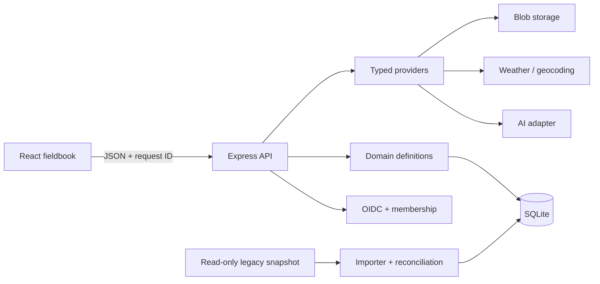

# Architecture

## System boundary

Hearth-v2 is a same-origin React and Express application backed by one isolated SQLite database. Capability modules follow property work rather than legacy repository structure.

## Request lifecycle

Public version, liveness, and readiness routes bypass identity. Every domain request then receives a request ID, verified identity, app-local membership, household scope, optional idempotency handling, validation, reference ownership checks, and an audit record for mutations. Errors use a stable JSON envelope and do not expose credentials or internal stack traces.

The domain route factory is deliberately small: resource definitions supply Zod schemas, foreign-reference rules, ordering, and table names; the factory supplies consistent CRUD, ownership, transactions, audit, and error behavior. Dashboard aggregation remains a dedicated query module because its semantics cross domains.

## Data model

Core ownership tables are `households`, `users`, and `household_memberships`. The remaining schema is grouped by capability:

- Maintenance: home items, tasks, warranties, photos, costs, and AI insights.
- Inventory: categories, locations, sub-locations, items, and images.
- Yard: mapped locations, tasks, and daily weather.
- Garden: fields, vegetables, beds, plantings, tasks, harvests, settings, and shopping.
- Pool: source-backed report metadata, printed and numeric readings, structured recommendations, chemical composition/inventory, and cached insights.
- Recipes: recipes, ingredients, and images.
- Operations: settings, blobs, audit, idempotency, migrations, import runs, reconciliation, and permanent identifier mappings.

SQLite foreign keys are enabled on every connection. DELETE journal mode is mandatory because Azure Files does not safely support the WAL assumptions this application would otherwise make.

## Provider boundary

AI, weather/geocoding, and blobs return a typed result: `ok`, `not_configured`, or `error`. Provider credentials stay server-side. Optional provider absence is visible through API behavior and readiness metadata but never prevents the database-backed household record from starting.

Local blobs are a development adapter only. Production refuses local filesystem authority; database rows store blob metadata and provider keys, not image bytes or authoritative container paths.

## Legacy import

The importer opens one explicitly named SQLite source read-only and computes canonical per-table hashes before writing. A single transaction writes owned rows, stable identifier mappings, the import fingerprint, and reconciliation evidence. Exact reruns return `no_op`; mapping upgrades can fill only newly introduced fields that remain untouched, while changed sources, collisions, schema drift, invalid rows, and unconfigured attachment-bearing sources abort before a partial import can be accepted.

Legacy data never becomes an implicit startup migration. Cutover remains a separate operator-controlled project after source, blob, count, hash, and user acceptance reconciliation.
